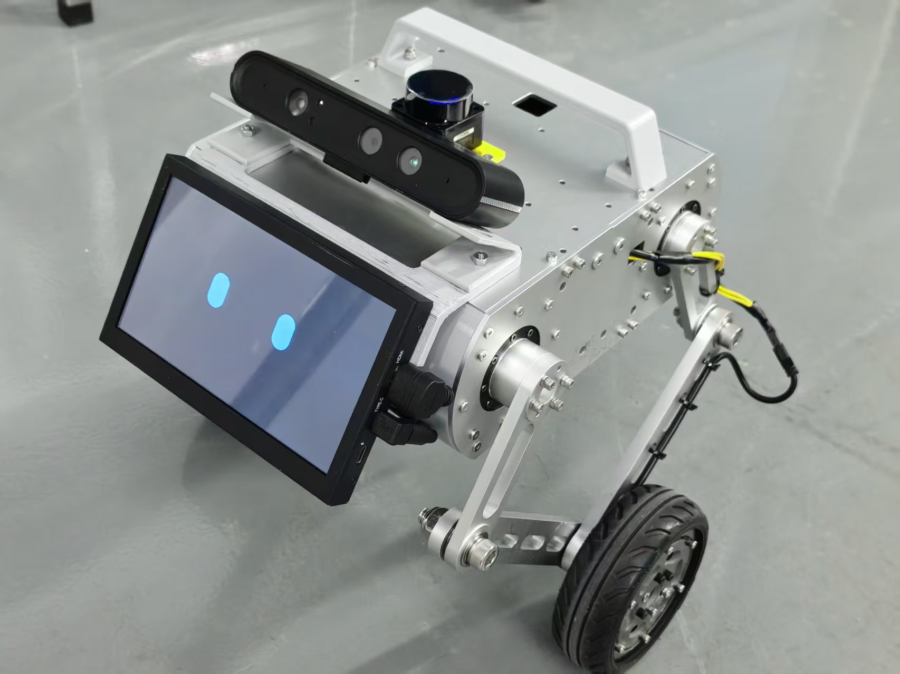

<div align="center">

# 基于犀牛派X1的家庭机器人

[](LICENSE)
[](https://www.aidlux.com/)
[](https://docs.ros.org/en/humble/)
[](https://www.python.org/)
[](https://www.st.com/)

基于犀牛派X1的家庭机器人，集成了视觉、语音、运动控制、SLAM导航和智能家居联动等多种功能，能够实现智能交互和自主导航。

</div>



---

## 目录

- [功能概览](#功能概览)
- [硬件规格](#硬件规格)
- [软件架构](#软件架构)
- [文件结构](#文件结构)
- [安装教程](#安装教程)
- [参考](#参考)
---

## 功能概览

- **轮足机器人控制** — 基于 STM32H723 + FreeRTOS 的底层控制，集成 EKF/Mahony 姿态解算、LQR 平衡控制、VMC 腿部运动学，支持前进/转向/跳跃/自起等动作能力。兼容 Xbox 无线手柄遥控，通过串口协议接收 ROS2 上位机指令。
- **SLAM/导航** — 集成 slam_toolbox 建图和 Nav2 导航框架，支持 AMCL 全局定位、路径规划与动态避障。提供区域导航管理（命名区域 + JSON 持久化），支持 Web 仪表盘可视化交互。
- **人员跟随** — 基于人工势场法的人体跟随，支持 Web 端框选目标，自动发布 `/goal_pose` 驱动机器人跟随。
- **ASR/TTS/KWS** — 本地部署 sherpa-onnx 关键词唤醒 + AidVoice NPU SenseVoice 语音识别 + VITS-Piper 中文语音合成，实现完全离线的语音交互。
- **GIF 表情播放器** — 基于 PySide6 的全屏 GIF 播放器，通过命名管道动态切换，实现情感化交互反馈。
- **Qwen3-4B LLM** — 在 NPU 上本地部署 Qwen3-4B-Instruct 模型，支持流式对话推理，通过 OpenAI 协议对接 Home Assistant 的语音Agent。
- **Home Assistant 集成** — 通过 MQTT 桥接和 REST API 将机器人传感器、状态、控制指令集成到 Home Assistant，实现智能家居联动和语音控制。
- **Web 仪表盘** — 基于 roslibjs 的实时 Web 可视化面板，支持实时数值/曲线监控、交互式地图（缩放/平移/导航选点/区域管理）、控制面板（运动控制/使能/急停）。

---

## 硬件规格

| 类别 | 组件 | 说明 |
|------|------|-----------|
| 上位机主控 | X1 派 (Rhino Pi X1) | 运行 Ubuntu + ROS2 + 本地 AI 模型 |
| 下位机主控 | 达妙 DM-MC02(STM32H723VGT6) | 电机驱动与控制 |
| Xbox手柄通信(可选) | ESP32 | BLE 连接 Xbox 手柄，串口转发至 STM32 |
| 关节电机 | GIM6010 ×4 | CAN 总线，髋关节驱动 |
| 轮毂电机 | DM6215 ×2 | CAN 总线，驱动轮 |
| IMU | BMI088 | 板载传感器，支持6轴姿态检测 |
| 激光雷达 | LD06 | 360° 2D 激光雷达 |
| 深度相机 | 奥比中光AstraPro | 视觉感知 |
| 显示屏 | 7 寸HDMI触摸屏 | 表情显示&触摸交互 |
| 电池 | DJI Matrice 4D电池 | 机器人24V供电 |

---

## 软件架构

```
┌───────────────────────────────────────────────────────────────┐
│                      智能家居层                                │
│   Home Assistant (Docker)                                     │
│   Assist Pipeline (STT → Conversation Agent → TTS)            │
│   MQTT Broker                                                 │
└─────┬──────────────────────────┬──────────────────────────────┘
      │ REST / Wyoming           │ MQTT
      ▼                          ▼
┌───────────────────────────────────────────────────────────────┐
│                      X1-Pi (ROS2 Humble)                       │
│                                                               │
│  ┌──────────────┐  ┌──────────────┐  ┌────────────────────┐   │
│  │ HA_Voice     │  │ Qwen3-4B LLM │  │ emotion_display    │   │
│  │ Assistant    │  │ (NPU 推理)    │  │ (GIF 表情播放)     │   │
│  │ (KWS/ASR/TTS)│  └──────┬───────┘  └────────────────────┘   │
│  └──────┬───────┘         │                                   │
│         │                 │                                   │
│  ┌──────┴─────────────────┴──────────────────────────────┐    │
│  │              ROS2 功能包 (wheel_legged_-ros2)          │   │
│  │                                                        │   │
│  │  stm32_bridge  wheel_foot_nav  perception              │   │
│  │  mqtt_bridge   region_manager  ldlidar_driver          │   │
│  │                                                        │   │
│  │  rosbridge_websocket ──► Web 仪表盘 (:8192)            │   │
│  └──────────────────────┬─────────────────────────────────┘   │
└─────────────────────────┼─────────────────────────────────────┘
                          │ UART (USB CDC)
                          ▼
┌───────────────────────────────────────────────────────────────┐
│                  STM32H723 (FreeRTOS)                         │
│                                                               │
│  姿态解算 (EKF/Mahony)  VMC 腿部控制  PID 控制器                │
│  LQR 平衡控制          跳跃控制       自起控制                  │
│  DM4310 / GIM6010 电机驱动 (CAN)                               │
│  Xbox 遥控接收   VOFA+ 调试输出  电源管理                       │
└─────┬─────────────────────────────────────────────────────────┘
      │ UART(可选)
      ▼
┌───────────────────────────────────────────────────────────────┐
│                     ESP32 (Xbox BLE)                          │
│  Xbox Series X 手柄蓝牙连接 → HID 解析 → 串口转发至 STM32       │
└───────────────────────────────────────────────────────────────┘
```


---

## 文件结构

整个机器人项目分为以下几个部分，分别位于仓库不同目录下，内部有更详细的说明：

- **[`Guide`](Guide)** — 项目文档与指南
  - [`机器人硬件安装指南.pdf`](Guide/机器人硬件安装指南.pdf) — 机械组装步骤
  - [`物料清单-机械.xlsx`](Guide/物料清单-机械.xlsx) / [`物料清单-电子.xlsx`](Guide/物料清单-电子.xlsx) — 完整 BOM
  - `Guide/STM32/` — [固件烧录教程](Guide/STM32/DM-MC02固件烧录教程.pdf) + 预编译固件 (.hex)
  - `Guide/X1_Ubuntu/` — X1 派部署指南：[Home Assistant](Guide/X1_Ubuntu/HomeAssistant/HomeAssistant-Docker安装.md) / [Qwen3-4B](Guide/X1_Ubuntu/Qwen3-4B-Instruct部署/Qwen3-4B-Instruct部署.md) / [语音助手](Guide/X1_Ubuntu/VoiceAssistant/语音助手部署指南.md) / [开机自启](Guide/X1_Ubuntu/开机自启配置.md)
  - 各电机/外设使用手册（LD06 雷达、GIM6010 电机、DM-MC02 开发板等）

- **[`Machine`](Machine)** — 机械结构设计与加工文件
  - [`3D打印件/`](Machine/3D打印件/) — 前/后面板、握把、支架等 3D 打印件
  - [`机加工件/`](Machine/机加工件/) — CNC 铝合金件 (底板/顶板/侧板/腿) + 玻纤板
  - [`SolidWorks/`](Machine/SolidWorks/) — SolidWorks 装配体 (`总装.SLDASM`) + 全部零件

- **[`Code`](Code)** — 软件代码（核心部分），详见 [Code/README.md](Code/README.md)
  - [`ESP32/ESP32_connect_Xbox/`](Code/ESP32/ESP32_connect_Xbox/) — [PlatformIO 工程](Code/ESP32/ESP32_connect_Xbox/README.md)，Xbox 手柄 BLE 桥接 → 串口转发（[串口协议](Code/ESP32/ESP32_connect_Xbox/SERIAL_PROTOCOL.md)）
  - [`STM32/ros2-wheel-foot-car/`](Code/STM32/ros2-wheel-foot-car/) — [Keil MDK 工程](Code/STM32/ros2-wheel-foot-car/README.md)，底层运动控制固件（EKF/VMC/PID/ROS2 通信）
  - [`X1-Pi/`](Code/X1-Pi/) — X1 派应用层
    - [`ROS2_Packages/`](Code/X1-Pi/ROS2_Packages/wheel_legged_-ros2/) — [ROS2 工作空间](Code/X1-Pi/ROS2_Packages/wheel_legged_-ros2/README.md)（stm32_bridge / Nav2 / perception / mqtt_bridge / region_manager / Web 仪表盘 / LiDAR 驱动）
    - [`HA_VoiceAssistant/`](Code/X1-Pi/HA_VoiceAssistant/) — [语音助手](Code/X1-Pi/HA_VoiceAssistant/README.md)（KWS + ASR + TTS + HA 集成）
    - [`emotion_display/`](Code/X1-Pi/emotion_display/) — [GIF 表情播放器](Code/X1-Pi/emotion_display/README.md)
    - [`Aid_LLM/`](Code/X1-Pi/Aid_LLM/) — Qwen3-4B-Instruct 本地部署

- **[`PCB`](PCB)** — 电路设计文件
  - [`分电板/`](PCB/分电板/) — 电源分配板 Gerber 文件 + BOM
  - [`降压板/`](PCB/降压板/) — 24V 降压板 Gerber 文件 + BOM

- **[`Matlab`](Matlab)** — [算法仿真](Matlab/simulation/README.md)
  - Simulink 轮腿动力学模型 + LQR 控制器设计

- **[`RES`](RES)** — 项目资源文件

---

## 安装教程

### 硬件部分

1. 参阅 [Machine/README.md](Machine/README.md) ，对 `3D打印件/` 和 `机加工件/` 目录下的设计文件进行加工
2. 参考 [物料清单-机械.xlsx](Guide/物料清单-机械.xlsx) 和 [物料清单-电子.xlsx](Guide/物料清单-电子.xlsx) 采购所需零件
3. 参阅 [PCB/](PCB/) 目录打样分电板和降压板
4. 参考 [Guide/机器人硬件安装指南.pdf](Guide/机器人硬件安装指南.pdf) 进行机械组装

### 软件部分

**系统要求：**
- X1 派：Ubuntu 22.04

**部署步骤：**

依次对 `Code/` 目录下的各子系统进行编译和部署：

| 子系统 | 文档入口 | 说明 |
|--------|----------|------|
| ESP32 | [README.md](Code/ESP32/ESP32_connect_Xbox/README.md) | PlatformIO 编译烧录 |
| STM32 | [README.md](Code/STM32/ros2-wheel-foot-car/README.md) | Keil MDK 编译下载，烧录教程见 [Guide/STM32/](Guide/STM32/) |
| ROS2 包 | [README.md](Code/X1-Pi/ROS2_Packages/wheel_legged_-ros2/README.md) | colcon 编译 + 一键启动脚本 |
| 语音助手 | [README.md](Code/X1-Pi/HA_VoiceAssistant/README.md) | Python 依赖安装 + 模型配置 |
| LLM 部署 | [部署指南](Guide/X1_Ubuntu/Qwen3-4B-Instruct部署/Qwen3-4B-Instruct部署.md) | NPU 模型推理部署 |
| Home Assistant | [部署指南](Guide/X1_Ubuntu/HomeAssistant/HomeAssistant-Docker安装.md) | Docker 安装 + 集成配置 |
| 开机自启 | [配置指南](Guide/X1_Ubuntu/开机自启配置.md) | systemd 服务配置 |

> **🚧 TODO：** X1 派的部署步骤较为复杂，后续将打包上传完整镜像文件至网盘，以便一键烧录部署。

---

## 参考

- [《轮腿式平衡机器人控制》— 陈阳](Matlab/simulation/轮腿式平衡机器人控制_陈阳.pdf)
- [达妙开源轮腿机器人项目](https://gitee.com/kit-miao/wheel-legged)
- [sherpa-onnx](https://github.com/k2-fsa/sherpa-onnx)
- [Home Assistant](https://www.home-assistant.io/)
- [ROS2](https://docs.ros.org/en/humble/) 
- [Qwen3](https://github.com/QwenLM/Qwen3)
- [VITS-Piper](https://github.com/rhasspy/piper)

---

本项目基于 Apache License 2.0 开源。详见 [LICENSE](LICENSE)。
